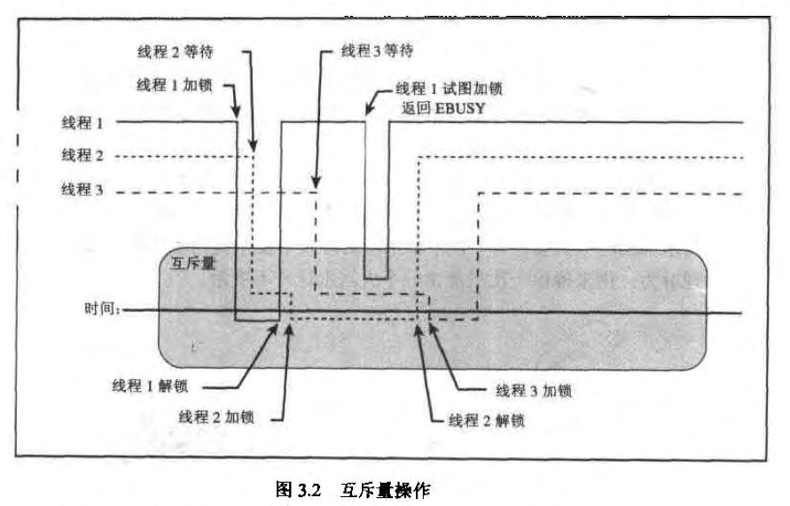

# chap3

### 互斥量的时序



### sched_yield

`sched_yield` 是一个由 POSIX 标准定义的系统调用，其作用是允许当前正在运行的线程放弃处理器，从而给其他线程运行的机会。
这个调用不会将线程置于休眠状态，而是将线程重新放回到可运行状态的线程队列中。

当你调用 `sched_yield` 时，调度器将当前线程放到同等优先级线程的末尾（如果有的话），从而促使调度器选择另一个线程进行执行。
如果没有其他线程在等待运行（即当前线程是同优先级中唯一的或者最高优先级的线程），则当前线程可能会立即被再次选中继续执行。

这个调用在多线程程序设计中可以用来减少线程之间的竞争，或者在一个线程需要等待某些条件（但不想通过睡眠来等待）时主动让出 CPU，以允许其他线程运行。
`sched_yield` 可以帮助改善线程调度的公平性，但其实际效果依赖于操作系统的调度策略和现有的线程优先级设置。

下面是一个简单的使用 `sched_yield` 的例子:

```c
#include <pthread.h>
#include <sched.h>

void *thread_function(void *arg) {
    // ... do some work ...

    // Now yield the processor
    sched_yield();

    // ... do more work ...
    return NULL;
}
```

在这个例子中，线程在执行完一部分工作后调用 `sched_yield`，这可能有助于其他等待运行的线程获得执行机会。
然而，频繁地使用 `sched_yield` 可能会导致性能问题，因此应该谨慎使用。
此外，它通常用于锁竞争激烈等高级同步问题，或者是实时系统的调度场景中。

### 乐观锁

乐观锁并不是锁，而是 cas(compare and swap)，是一种原子操作。

悲观锁就是：真正的锁，独占资源，并且甚至是不能读取资源

### pthread_cond_timedwait

`pthread_cond_timedwait` 是 POSIX 线程（Pthreads）库中的一个函数，用于阻塞当前线程等待一个条件变量在指定的时间内被触发。
它是 `pthread_cond_wait` 函数的超时版本，允许线程在等待条件变量时设置一个超时时间，以避免无限期地等待。

这个函数通常与互斥锁（mutex）一起使用，以在多线程程序中同步对共享资源的访问。
它的主要用途是线程同步，允许线程睡眠，直到某个条件成立或发生超时。

函数的声明如下：

```c
#include <pthread.h>

int pthread_cond_timedwait(pthread_cond_t *restrict cond,
                           pthread_mutex_t *restrict mutex,
                           const struct timespec *restrict abstime);
```

参数说明：

- `cond`：指向条件变量的指针，该条件变量必须已被初始化。
- `mutex`：指向互斥锁的指针，该锁在调用 `pthread_cond_timedwait` 时必须已被当前线程锁定（通过 `pthread_mutex_lock`），并且在等待期间，该函数会自动释放互斥锁。
- `abstime`：指向 `timespec` 结构的指针，该结构表示一个绝对的超时时间（通常是从 Epoch（1970-01-01 00:00:00 UTC）开始计算的时间）。
  超时时间是以系统时钟为基础的，通常是 `CLOCK_REALTIME`。

返回值：

- 如果函数成功，即在超时之前条件变量被触发，那么函数返回 0。
- 如果在指定的超时时间内条件未被触发，函数将返回 `ETIMEDOUT`。
- 如果发生错误，将返回一个不同的错误码。

使用示例：

```c
pthread_mutex_t mutex = PTHREAD_MUTEX_INITIALIZER;
pthread_cond_t cond = PTHREAD_COND_INITIALIZER;

// 设置超时时间为1秒后
struct timespec ts;
clock_gettime(CLOCK_REALTIME, &ts);
ts.tv_sec += 1;

pthread_mutex_lock(&mutex);

// 这里可能是检查某个条件的代码
while (!condition) {
    int rc = pthread_cond_timedwait(&cond, &mutex, &ts);
    if (rc == ETIMEDOUT) {
        // 超时处理
        break;
    }
    // 可能需要再次检查条件
}

pthread_mutex_unlock(&mutex);
```

在这个例子中，我们首先获取当前时间，并设置超时时间为 1 秒后。
然后锁定互斥锁，检查条件，如果条件不满足，调用 `pthread_cond_timedwait` 等待条件或超时。
如果函数返回超时错误码 `ETIMEDOUT`，则可以执行超时后的处理代码。最后，不管是条件满足还是超时，都释放互斥锁。

### 被拦截的唤醒

也就是不是因为 notify_one 或者是 notify_all 导致的唤醒

被拦截的唤醒（spurious wakeup）是指线程在没有收到明确的条件变量信号（如：`pthread_cond_signal` 或 `pthread_cond_broadcast`）的情况下，
`pthread_cond_wait` 调用却意外返回的现象。这可能由于多种原因引起，其中包括但不限于操作系统的调度策略、线程库的实现细节，或者硬件级别的中断。

举个例子，假设你有一个生产者-消费者场景，其中消费者线程等待一个条件变量，表示队列中有元素可供消费。这里的谓词就是“队列不为空”。代码可能如下：

```c
pthread_mutex_t mutex = PTHREAD_MUTEX_INITIALIZER;
pthread_cond_t cond = PTHREAD_COND_INITIALIZER;
std::queue<int> queue;

// 消费者线程
void* consumer(void* arg) {
    pthread_mutex_lock(&mutex);

    while (queue.empty()) {  // 谓词检查：队列是否为空
        pthread_cond_wait(&cond, &mutex);  // 在这里等待
        // 被拦截的唤醒可能在这里发生，继续检查队列是否真的不为空
    }

    int item = queue.front();
    queue.pop();

    pthread_mutex_unlock(&mutex);
    // 消费item...
    return NULL;
}
```

在这个例子中，消费者线程检查队列是否为空，如果为空，它就等待一个信号，这个信号应该在生产者线程向队列添加新元素时发出。
但是，由于被拦截的唤醒，`pthread_cond_wait` 可能在没有新元素被添加进队列的情况下返回。

可能导致被拦截唤醒的原因包括：

1. **信号处理**：如果线程在等待条件变量时接收到信号，信号处理函数执行完毕后，`pthread_cond_wait` 可能会返回，即便条件变量未被其他线程显式地触发。

2. **优化和实现**：为了提高性能和简化线程库的实现，线程等待和唤醒的机制可能不会精确地映射到条件变量的信号。线程库可能会为了优化而在没有收到信号的情况下唤醒线程。

3. **硬件中断**：底层硬件中断可以导致操作系统从等待状态中唤醒线程，即使没有相关的条件变量信号。

由于以上原因，线程在返回等待状态后必须重新检查条件，这就是为什么通常建议将 `pthread_cond_wait` 调用放在一个循环中来检查条件的原因。
这种模式可以确保即便发生被拦截的唤醒，线程也会再次进入等待状态，直到条件真正得到满足。

### 被 notify_one，但是 mutex 依然被占用 ---> 继续等待

可能会出现互斥量（mutex）被占用，但条件变量的 `notify_one`（在 POSIX 线程中对应 `pthread_cond_signal`）被调用的情况。
这实际上是在多线程程序中一个常见的场景，因为 `notify_one` 或 `pthread_cond_signal` 的目的就是通知等待条件变量的线程一个条件已经满足，
而这可以在持有相关互斥量的任何线程中发生。

这里是一个简化的例子来说明这种情况：

```c
pthread_mutex_t mutex = PTHREAD_MUTEX_INITIALIZER;
pthread_cond_t cond = PTHREAD_COND_INITIALIZER;
bool ready = false;

// 生产者线程
void* producer(void* arg) {
    pthread_mutex_lock(&mutex);
    // 生产者创建了一个产品或者完成了一个任务
    ready = true;
    pthread_mutex_unlock(&mutex);

    // 通知一个等待的消费者线程条件已经满足
    // 注意，这里并不需要持有互斥锁
    pthread_cond_signal(&cond);

    return NULL;
}

// 消费者线程
void* consumer(void* arg) {
    pthread_mutex_lock(&mutex);
    while (!ready) {  // 这里是一个谓词，它检查条件是否满足
        // 在互斥量锁定的同时等待条件满足的信号
        pthread_cond_wait(&cond, &mutex);
    }
    // 消费者进行消费操作
    pthread_mutex_unlock(&mutex);
    return NULL;
}
```

在上面的代码中，生产者线程在完成一个任务后会释放互斥锁，并紧接着通过 `pthread_cond_signal` 发送信号。
这时，即使互斥量已经被释放，等待的消费者线程仍然可能在互斥量锁定的状态下处于等待中。当生产者调用 `pthread_cond_signal` 时，它并不需要持有互斥锁。

这个信号意味着至少有一个等待的消费者线程将被唤醒（或者当它下一次尝试等待时将不会被阻塞），但唤醒的线程并不会立即执行，它将尝试重新获取互斥锁。
只有当它成功获取到互斥锁时，它才会继续执行。如果互斥锁被其他线程占用，那么即使收到了信号，消费者线程也必须等待直到互斥锁变得可用。

这个信号机制并不保证哪个线程会获取互斥锁，或者等待的线程何时会执行；它只保证当条件变量被触发时，至少有一个等待的线程将会被唤醒。
