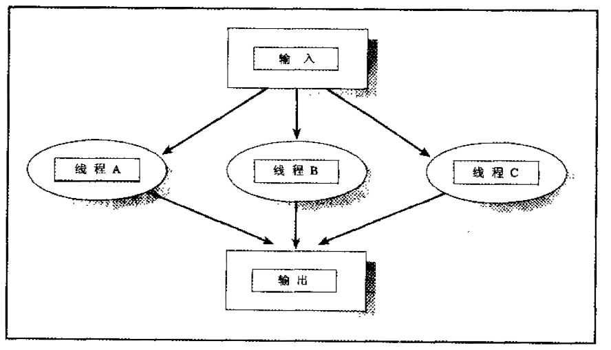

# chap4

## 流水线模式

### 先通知，再解锁

在多线程编程中，特别是使用条件变量时，确实存在一个常见的疑问：为什么要在解锁互斥锁之前发送条件变量信号？

这样做的主要理由是为了避免所谓的“信号丢失”和“虚假唤醒”。如果您先解锁互斥锁再发送条件变量信号，可能会出现以下情况：

1. 线程 A 完成数据处理，释放互斥锁。
2. 线程 B 尝试获取互斥锁并成功，但它可能在线程 A 发送信号之前开始运行。
3. 线程 A 现在发送条件变量信号，但因为没有线程在等待这个条件（因为线程 B 已经在运行并且可能已经过了等待条件的代码），所以信号将会丢失。
4. 线程 B 可能会在没有数据的情况下卡在下一个等待条件的地方，因为它错过了信号。

为了避免这种情况，您应该在持有互斥锁的情况下发送信号，这样可以确保条件的变化（例如，数据准备好了）和通知这一变化（发送信号）之间的原子性。
换句话说，当线程收到信号并最终获取到互斥锁时，它可以安全地假定相关的条件已经满足。

下面是您代码中的典型例子，展示了这一过程：

```c
stage->data_ready = 1; // 设置数据已准备好的标志
status = pthread_cond_signal(&stage->avail); // 发送信号以通知其他线程数据已准备好
if (status != 0) {
    pthread_mutex_unlock(&stage->mutex);
    return status;
}
status = pthread_mutex_unlock(&stage->mutex); // 最后释放互斥锁
return status;
```

此处，`pthread_cond_signal` 在 `pthread_mutex_unlock` 之前调用，确保在数据状态改变和通知其他线程之间不会有其他线程介入并导致状态的不一致。

总的来说，这种模式是为了确保数据的完整性和通知的可靠性，防止在多线程环境下出现竞争条件和逻辑错误。

## 工作组模式


